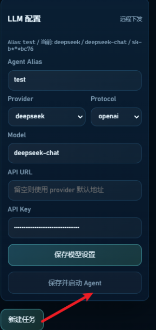
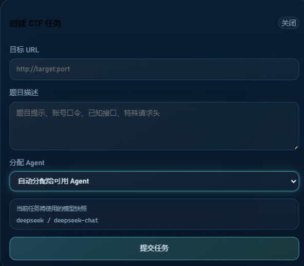
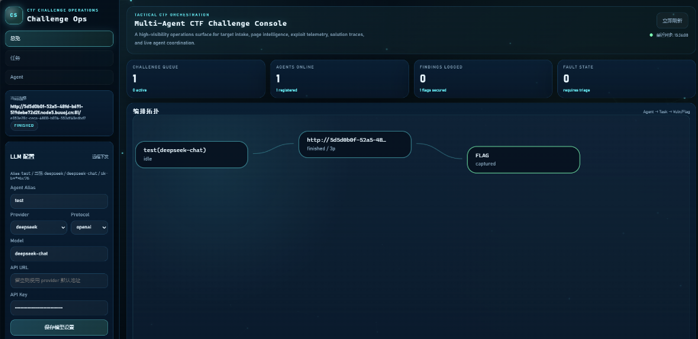
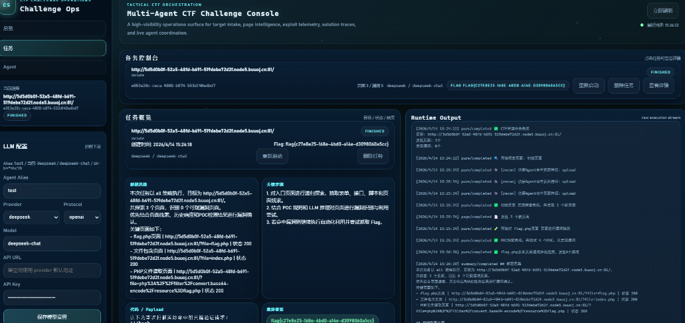
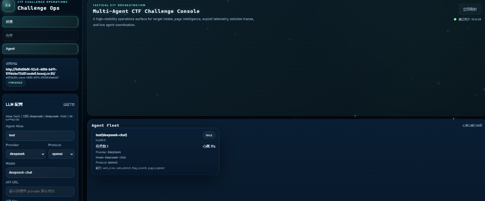

# CTFAutomate - 自动化解题工具

## 📖 项目介绍
这是一个基于多Agent架构的CTF自动解题工具。

## 🔧 功能特性
- 🌐 **多Agent协同**：包含探索、扫描、解题、执行四大核心模块
- 🤖 **智能LLM集成**：深度适配DeepSeek等大模型，自动分析题目逻辑
- 🛠️ **全流程自动化**：从页面探测到Flag捕获，一键完成

## 📄 许可证
本项目仅供学习交流使用。
## Ubuntu

### 1. 安装基础环境

```bash
sudo apt update
sudo apt install -y curl ca-certificates python3 python3-pip python3-venv
curl -LsSf https://astral.sh/uv/install.sh | sh
source ~/.local/bin/env
uv --version
python3 --version
```

建议使用 Python 3.11 或 3.12。

### 2. 给脚本执行权限

```bash
cd /path/to/ctfSolver-master
chmod +x scripts/s*
```

### 3. 启动全部服务

```bash
./scripts/start_all.sh
```

默认会启动后端和前端，不会自动启动 agent（前端可以启动）。



如果你想连 agent 也一起启动：

```bash
START_AGENT=1 ./scripts/start_all.sh
```

如果脚本提示当前未启动 agent，可在前端点击“保存并启动 Agent”，或单独执行：

```bash
./scripts/start_agent.sh
```

启动后访问：

- 前端控制台: `http://127.0.0.1:8080`
- 后端 API: `http://127.0.0.1:5000`
- 健康检查: `http://127.0.0.1:5000/health`

如果你是从 Windows 浏览器访问 WSL，通常直接打开：

- `http://localhost:8080`
- `http://localhost:5000`

### 4. 停止服务

```bash
./scripts/stop_all.sh
```

### 5. 日志目录

- `runtime/backend.log`
- `runtime/frontend.log`
- `runtime/agent*`

### 6. 常用验证命令

```bash
curl http://127.0.0.1:5000/health
curl http://127.0.0.1:5000/api/settings/llm
curl http://127.0.0.1:5000/api/dashboard/overview
curl http://127.0.0.1:5000/api/agents/status
```

# 使用说明：

先完成 LLM 配置，DeepSeek 的 API 密钥可通过网址https://platform.deepseek.com/api_keys获取，完成配置后点击保存并启动 Agent，接着点击新建任务执行



总览页面



任务页面



Agent页面



#### 若出现异常问题，可前往 runtime 目录查看日志文件定位问题
